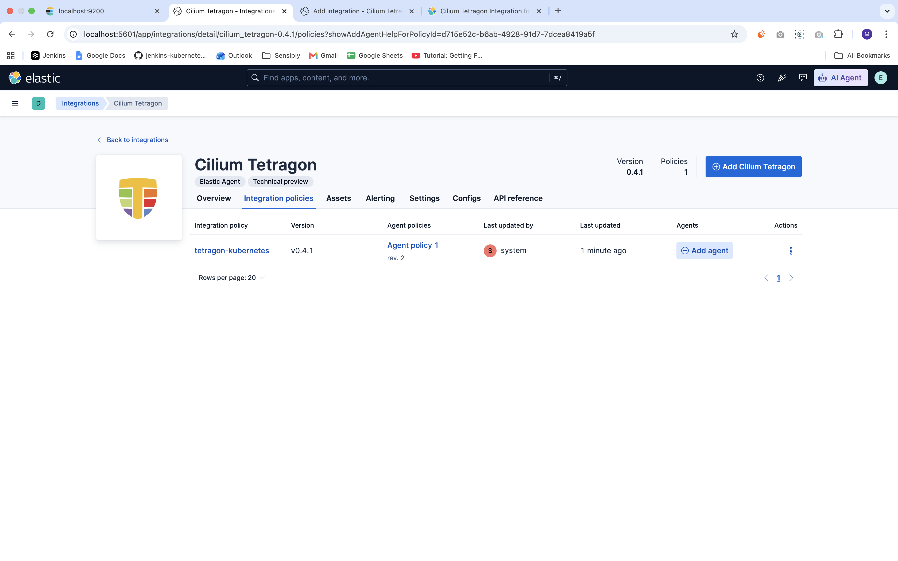

This project is to practice Implementing Email Alert on Tetragon Events using ElastAlert2 for hands on poc 

This project is an extension of the earlier project on integration of Tetragon with ELK Stack 
for visualizing Tetragon Events, and collect Event Logs: 
https://github.com/Ashir-Qayyum/tetragon-elk-stack-poc.git 

Email Alert on Gmail: 
.png>) 

Tetragon Integration in Kibana: 
 

Tetragon Events in Kibana (Updated): 
.png>) 